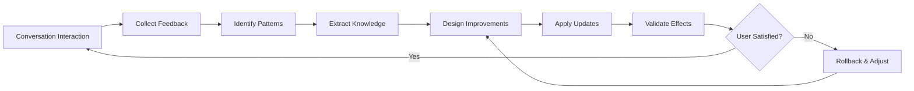

# Agent Learning Skill

## 🎯 Skill Overview

This skill enables agents to learn from conversation history and continuously improve their behavior. It provides structured workflows for analyzing user feedback, identifying patterns, and updating agent configuration files accordingly.

**Purpose**: Help agents adapt to user preferences by systematically collecting feedback, extracting insights, and applying configuration improvements.

**When to Use**: 
- User provides explicit feedback about agent behavior
- Repeated corrections or suggestions are detected
- Periodic agent optimization is needed
- User requests improvement based on conversation history

## 📊 Core Capabilities

### 1. Conversation Pattern Analysis
- **User Preference Recognition**:
  - Code style preferences (naming conventions, commenting habits, architecture patterns)
  - Communication style preferences (concise/detailed, technical depth, example requirements)
  - Workflow preferences (plan-first-then-execute, iterative development, test-driven)
  - Tool usage preferences (specific frameworks, libraries, command-line tools)

- **Feedback Pattern Detection**:
  - Explicit feedback: "You always...", "I hope...", "Don't..."
  - Implicit feedback: Behaviors users repeatedly correct
  - Satisfaction signals: Expressions of gratitude, approval, or dissatisfaction
  - Recurring issues: Same problems mentioned multiple times

- **Behavior Pattern Learning**:
  - Common task types and frequency
  - Preferred solution patterns
  - Error tolerance and quality requirements
  - Response speed and detail level expectations

### 2. Knowledge Extraction and Structuring

#### Key Information Extracted from Conversations
```markdown
1. User Command Patterns
   - Common command and request formats
   - Preferred task decomposition methods
   - Expected output formats

2. Quality Standards
   - Code quality requirements (test coverage, documentation completeness)
   - Performance requirements (speed, memory, scalability)
   - Maintainability requirements (modularity, comments, naming)

3. Workflow Preferences
   - Project startup processes
   - Debugging and problem-solving methods
   - Code review and improvement habits

4. Domain Expertise
   - Technology stacks the user is familiar with
   - Business domain terminology and concepts
   - Industry best practice awareness
```

#### Learning Record Template
```yaml
learning_record:
  timestamp: "YYYY-MM-DD HH:mm:ss"
  category: "code_style|communication|workflow|quality|domain_knowledge"
  observation: "Observed user behavior or preference"
  evidence: "Specific evidence from conversation (quotes)"
  confidence: 0.0-1.0  # Confidence level
  action_taken: "Improvement measures taken"
  status: "pending|applied|verified|rejected"
```

### 3. Agent Configuration Optimization Strategies

#### System Prompt Optimization
- **Role Definition Enhancement**: Refine Agent's role positioning based on user expectations
- **Behavior Guideline Updates**: Add or modify Do's and Don'ts
- **Priority Adjustment**: Reorder tasks and focus areas
- **Context Enhancement**: Add project-specific knowledge and constraints

#### Tool Permission Management
- Adjust tool permissions based on usage frequency and user feedback
- Identify unnecessary tool access and suggest removal
- Discover missing tool needs and suggest additions

#### Workflow Improvement
- Optimize task execution order
- Add automated checkpoints
- Improve error handling and recovery mechanisms
- Enhance user interaction experience

### 4. Change Management and Version Control

#### Change Records
```markdown
## Agent Configuration Change Log

### [Version] - YYYY-MM-DD
#### Added
- New rules or behavioral guidelines

#### Modified
- Modified existing rules
- Optimized workflows

#### Removed
- Removed outdated or inapplicable rules

#### Rationale
- Basis for changes and user feedback sources
```

#### Rollback Mechanism
- Keep backups of historical versions
- Support quick rollback to previous configurations
- Record effectiveness evaluation for each change

### 5. Effectiveness Evaluation and Validation

#### Quantitative Metrics
- **User Satisfaction**: Ratio of positive vs negative feedback
- **Efficiency Improvement**: Changes in time required to complete tasks
- **Accuracy Improvement**: Reduction in errors and corrections
- **Adoption Rate**: Percentage of suggestions accepted by users

#### Qualitative Assessment
- Improvements proactively mentioned by users
- Enhanced conversation fluency
- Reduced clarification and confirmation requests
- Less rework and corrections needed

## 🔧 Workflow

### Phase 1: Conversation History Collection and Analysis
```
1. Read recent conversation history (recommend last 10-20 conversation turns)
2. Identify key user feedback and suggestions
3. Extract recurring patterns and preferences
4. Categorize learning content (code, communication, workflow, etc.)
```

### Phase 2: Learning Opportunity Identification
```
1. Mark explicit feedback (issues directly pointed out by users)
2. Detect implicit patterns (preferences inferred from behavior)
3. Identify knowledge gaps (concepts users repeatedly explain)
4. Discover efficiency bottlenecks (common friction points)
```

### Phase 3: Improvement Plan Design
```
1. Determine which Agent configuration sections need updating
2. Design specific improvement measures
3. Evaluate potential impact of improvements
4. Prepare change content and rationale explanations
```

### Phase 4: Configuration Update Execution
```
1. Read current Agent configuration file
2. Apply planned changes
3. Maintain configuration format and structure consistency
4. Add change annotations and version markers
```

### Phase 5: Change Validation and Summary
```
1. Check syntax and format of updated configuration file
2. Generate change summary report
3. Present learning outcomes and improvements to user
4. Request user confirmation or further feedback
```

## 📝 Output Template

When executing Agent learning tasks, organize responses according to the following structure:

```markdown
## 📚 Learning Outcomes Summary

### Conversation Analysis Overview
- Number of conversation turns analyzed: [n]
- Time range: [start] - [end]
- Learning points identified: [n]

### Key Findings

#### 1. User Preference Recognition
**Category**: [Code Style/Communication/Workflow/Quality Standards]
**Observation**: [Detailed description of discovered preference]
**Evidence**:
- "[Quote from conversation 1]"
- "[Quote from conversation 2]"
**Confidence**: [High/Medium/Low]

#### 2. Behavior Improvement Suggestions
**Current Behavior**: [Describe current Agent behavior]
**Problem**: [Explain existing issues or mismatches]
**Suggested Improvement**: [Specific improvement plan]
**Expected Outcome**: [Benefits after improvement]

### 🔄 Agent Configuration Update

#### Change Content
```diff
+ Added rules or guidelines
- Removed content
~ Modified content
```

#### Update Rationale
[Detailed explanation of why these changes are needed, citing user feedback]

#### Impact Assessment
- **Positive Impact**: [Expected improvement effects]
- **Potential Risks**: [Possible side effects or considerations]
- **Compatibility**: [Coordination with other rules]

### ✅ Execution Status
- [ ] Configuration file read
- [ ] Changes applied
- [ ] Format validation passed
- [ ] Backup created
- [ ] Awaiting user confirmation

### 💡 Follow-up Suggestions
1. [Specific scenarios for user to test]
2. [Behaviors requiring continued observation]
3. [Next learning priorities]
```

## 💻 Implementation Guide

### Python Helper Script Example (Optional)

```python
import json
import yaml
from datetime import datetime
from pathlib import Path

class AgentLearningManager:
    def __init__(self, agent_file_path: str):
        self.agent_file = Path(agent_file_path)
        self.learning_log = Path("learning_log.json")
        
    def parse_conversation(self, conversation_history: list) -> dict:
        """Parse conversation history and extract learning points"""
        learnings = {
            'preferences': [],
            'feedback': [],
            'patterns': [],
            'knowledge_gaps': []
        }
        
        for turn in conversation_history:
            # Extract user feedback
            if self._is_feedback(turn['user_message']):
                learnings['feedback'].append({
                    'type': turn['feedback_type'],
                    'content': turn['user_message'],
                    'timestamp': turn['timestamp']
                })
            
            # Identify repeated patterns
            if self._is_repeated_pattern(turn):
                learnings['patterns'].append(turn)
        
        return learnings
    
    def generate_update_plan(self, learnings: dict) -> dict:
        """Generate update plan based on learning results"""
        update_plan = {
            'additions': [],
            'modifications': [],
            'deletions': [],
            'rationale': []
        }
        
        # Process high-frequency feedback
        high_freq_feedback = self._find_high_frequency_feedback(learnings['feedback'])
        for feedback in high_freq_feedback:
            update_plan['modifications'].append({
                'section': feedback['target_section'],
                'change': feedback['suggested_change'],
                'reason': feedback['evidence']
            })
        
        return update_plan
    
    def apply_updates(self, update_plan: dict) -> bool:
        """Apply updates to Agent configuration file"""
        try:
            # Read current configuration
            with open(self.agent_file, 'r', encoding='utf-8') as f:
                content = f.read()
            
            # Create backup
            backup_path = self.agent_file.with_suffix('.md.bak')
            backup_path.write_text(content, encoding='utf-8')
            
            # Apply changes (implement based on actual format)
            updated_content = self._apply_changes(content, update_plan)
            
            # Write updated content
            with open(self.agent_file, 'w', encoding='utf-8') as f:
                f.write(updated_content)
            
            # Log changes
            self._log_change(update_plan)
            
            return True
        except Exception as e:
            print(f"Update failed: {e}")
            return False
    
    def _is_feedback(self, message: str) -> bool:
        """Detect if message is feedback"""
        feedback_keywords = ['hope you', 'don\'t', 'should', 'better', 'improve', 'change']
        return any(keyword in message.lower() for keyword in feedback_keywords)
    
    def _apply_changes(self, content: str, update_plan: dict) -> str:
        """Apply changes to content"""
        # Implement specific text replacement logic
        updated = content
        
        for addition in update_plan['additions']:
            updated += f"\n{addition}"
        
        for modification in update_plan['modifications']:
            # Implement specific modification logic
            pass
        
        return updated

# Usage example
manager = AgentLearningManager('.lingma/agents/AI-Planner.md')
learnings = manager.parse_conversation(conversation_history)
update_plan = manager.generate_update_plan(learnings)
success = manager.apply_updates(update_plan)
```

## ⚡ Quick Decision Guide

### When to Trigger Learning Updates?

| Trigger Condition | Action | Priority |
|------------------|--------|----------|
| User explicitly says "remember this" | Immediately record and update | High |
| Same issue corrected 3+ times | Analyze pattern and suggest update | High |
| User expresses dissatisfaction or frustration | Urgent review and adjustment | High |
| Complete an important project phase | Phase summary and update | Medium |
| Detect new work pattern | Record and observe | Low |
| Regular review (weekly/monthly) | Systematic analysis and optimization | Medium |

### Change Risk Assessment

**Low Risk Changes** ✅
- Adding new examples or explanations
- Supplementing project-specific knowledge
- Refining existing rules
- Adding optional best practices

**Medium Risk Changes** ⚠️
- Modifying existing behavior rules
- Adjusting tool permissions
- Changing workflow order
- Adding mandatory requirements

**High Risk Changes** ❗
- Deleting core functionality or rules
- Significantly changing role positioning
- Removing frequently used tools
- Changing basic interaction patterns

## 🎓 Best Practices

### DOs ✅
- ✅ Always seek user confirmation before updates
- ✅ Preserve detailed change rationale and evidence
- ✅ Create backups for rollback capability
- ✅ Make incremental improvements, avoid large-scale refactoring
- ✅ Record effectiveness and feedback for each learning
- ✅ Balance generality and personalization
- ✅ Regularly clean up outdated or conflicting rules
- ✅ Use concrete examples to illustrate abstract rules

### DON'Ts ❌
- ❌ Don't make major changes based on single feedback
- ❌ Don't ignore explicit user objections
- ❌ Don't overfit to individual scenarios
- ❌ Don't let configuration files become overly complex
- ❌ Don't delete rules proven to be effective
- ❌ Don't assume user intent, always confirm
- ❌ Don't forget to test effects after updates
- ❌ Don't ignore interactions between rules

## 🔍 Learning Pattern Recognition

### Explicit Feedback Patterns
```
User says: "You always..." → Identify recurring problems
User says: "I hope you..." → Clear expectations and needs
User says: "Don't..." → List of prohibited behaviors
User says: "Good/Correct" → Successful behavior patterns
User says: "Wrong/Incorrect" → Behaviors needing correction
```

### Implicit Feedback Patterns
```
User repeats same question → Memory or understanding issues
User manually corrects output → Quality standard mismatch
User skips certain steps → Process not efficient enough
User provides extra explanations → Knowledge gaps exist
User expresses frustration → Experience needs improvement
```

### Preference Inference Patterns
```
Consistently chooses certain approach → Prefers that approach
Frequently asks about certain topics → High interest in that area
Quickly accepts certain suggestions → Matches work habits
Repeatedly rejects certain methods → Not suitable for current scenario
```

## 📊 Learning Effectiveness Tracking

### Tracking Metrics
```yaml
metrics:
  feedback_sentiment:
    positive_count: 0
    negative_count: 0
    neutral_count: 0
  
  correction_frequency:
    same_issue_count: {}  # Count by issue type
    time_between_corrections: []
  
  adoption_rate:
    suggestions_accepted: 0
    suggestions_rejected: 0
    suggestions_modified: 0
  
  efficiency_improvement:
    avg_task_time_before: 0
    avg_task_time_after: 0
    clarification_requests_reduction: 0%
```

### Regular Review Checklist
- [ ] Collect all user feedback from past period
- [ ] Identify patterns appearing 3+ times
- [ ] Evaluate effectiveness of existing rules
- [ ] Check for conflicting rules
- [ ] Validate whether recent changes were effective
- [ ] Identify new learning opportunities
- [ ] Clean up outdated learning content
- [ ] Update priorities and weights

## 💬 Usage Tips

When you need the Agent to learn and self-improve, trigger it as follows:

### Automatic Trigger
- Provide feedback directly, Agent will identify learning opportunities
- After completing important tasks, Agent may proactively summarize
- When detecting repeated patterns, Agent will suggest improvements

### Manual Trigger
Use command `/agent-learning` or explicitly request:

- "Please learn from our conversations and update your configuration"
- "Analyze my recent feedback and improve your behavior"
- "Summarize my preferences and update your rules"
- "Review our past conversations and see what can be improved"
- "I notice you often make a certain mistake, please learn and correct it"

### Learning Confirmation Process
```
1. Agent analyzes conversation history
2. Identifies learning points and improvement opportunities
3. Proposes specific update plans
4. Presents change content and rationale
5. Requests user confirmation
6. Applies changes and validates
7. Records learning outcomes
```

## 🔄 Continuous Improvement Cycle



## 📚 Related Resources

### Learning Theory
- Reinforcement learning fundamentals
- Reinforcement Learning from Human Feedback (RLHF)
- Incremental learning and online learning
- Transfer learning and domain adaptation

### Configuration File Management
- YAML/Markdown best practices
- Version control and change tracking
- Configuration validation and testing
- Documentation and annotation standards

### User Experience Optimization
- Human-computer interaction design principles
- Personalized recommendation systems
- Adaptive interface design
- User modeling and profiling

## ⚠️ Important Considerations

### Privacy and Security
- Only learn work-related preferences and behaviors
- Don't store sensitive or personal privacy information
- Users can clear learning records at any time
- All learning data stored locally

### Controllability
- Users have final decision authority
- All changes are traceable and reversible
- Automatic learning can be disabled
- Learning records can be manually edited

### Transparency
- Clearly display learning content and basis
- Explain rationale for each change
- Provide learning effectiveness feedback
- Allow users to question and correct

Remember: The goal of learning is to better serve users, not simply accumulate rules. Always maintain flexibility and prioritize meeting users' actual needs.
