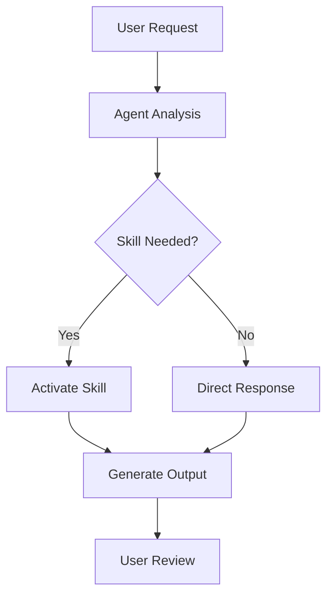

# Contributing to Vibe Coding

Thank you for your interest in contributing to the Vibe Coding methodology! 🎉

This document provides guidelines and instructions for contributing to this project.

## 📋 Table of Contents

- [Code of Conduct](#code-of-conduct)
- [How Can I Contribute?](#how-can-i-contribute)
- [Development Setup](#development-setup)
- [Contributing Agents & Skills](#contributing-agents--skills)
- [Documentation Guidelines](#documentation-guidelines)
- [Pull Request Process](#pull-request-process)
- [Community](#community)

---

## Code of Conduct

### Our Pledge

We are committed to providing a welcoming and inspiring community for all. We pledge to make participation in our project a harassment-free experience for everyone.

### Our Standards

**Positive behavior includes:**
- Using welcoming and inclusive language
- Being respectful of differing viewpoints and experiences
- Gracefully accepting constructive criticism
- Focusing on what is best for the community
- Showing empathy towards other community members

**Unacceptable behavior includes:**
- The use of sexualized language or imagery
- Trolling, insulting/derogatory comments, and personal attacks
- Public or private harassment
- Publishing others' private information without permission
- Other conduct which could reasonably be considered inappropriate

---

## How Can I Contribute?

### 🐛 Reporting Bugs

Before creating bug reports, please check existing issues. When creating a bug report, include:

**Required Information:**
- **Clear title and description**
- **Steps to reproduce** the behavior
- **Expected vs actual behavior**
- **Environment details** (OS, VS Code version, extension version)
- **Screenshots** if applicable

**Example:**
```markdown
**Bug**: Agent not loading in Chat Panel

**Steps to Reproduce**:
1. Open VS Code
2. Open Chat Panel (Ctrl+Shift+I)
3. Click agent selector
4. vibe-coder not listed

**Expected**: vibe-coder agent should appear in list
**Actual**: Only default agents shown

**Environment**: 
- OS: Windows 11
- VS Code: 1.85.0
- Tongyi Lingma: 2.0.0

**Additional Context**:
- .lingma/agents/vibe-coder.md exists
- Tried reloading window multiple times
```

### 💡 Suggesting Enhancements

Feature suggestions should include:

- **Use case**: Why is this feature needed?
- **Proposed solution**: How should it work?
- **Alternatives considered**: Other approaches
- **Examples**: Mock-ups or code examples

**Example:**
```markdown
**Feature**: Add debugging skill

**Use Case**: 
Currently debugging requires manual steps. A dedicated skill would streamline the process.

**Proposed Solution**:
Create /debugging skill that:
1. Analyzes error messages
2. Suggests common causes
3. Provides step-by-step debugging approach
4. Generates debug logging code

**Alternatives**:
- Could enhance existing refactoring skill
- Could create separate troubleshooting agent

**Example Workflow**:
User: "/debugging - My API returns 500 error"
Skill: [Provides debugging checklist and tools]
```

### 🔧 Your First Code Contribution

**Good first issues:**
- Documentation improvements
- Adding examples to skills
- Fixing typos or formatting
- Adding test cases
- Improving error messages

**Getting Started:**
1. Fork the repository
2. Clone your fork
3. Create a branch: `git checkout -b feature/your-feature-name`
4. Make your changes
5. Test thoroughly
6. Submit a pull request

---

## Development Setup

### Prerequisites

- **Git**: Version control system
- **VS Code**: Code editor
- **Tongyi Lingma extension**: AI assistant
- **Node.js** (optional): For JavaScript examples

### Local Development

1. **Fork and Clone**
```bash
git clone https://github.com/YOUR_USERNAME/vibeCoding.git
cd vibeCoding
```

2. **Open in VS Code**
```bash
code .
```

3. **Verify Structure**
Ensure the following directories exist:
```
.lingma/agents/
.lingma/skills/
docs/
```

4. **Test Agents and Skills**
- Open Chat Panel in VS Code
- Verify vibe-coder agent appears
- Test skill activation with `/code-generation`, etc.

---

## Contributing Agents & Skills

### Creating New Agents

**When to Create an Agent:**
- New persona or role needed
- Different tool permissions required
- Unique working style or expertise
- Specialized domain knowledge

**Agent File Structure:**
```markdown
---
name: agent-name
description: Clear, concise description for auto-detection
tools:
  - Read
  - Write
  - Edit
  - [Other tools as needed]
---

# Agent Name

## Role
[Define the agent's identity]

## Expertise
[List areas of expertise]

## Working Style
[Describe how the agent operates]

[Additional sections as needed]
```

**Example:**
```markdown
---
name: security-auditor
description: Security-focused code reviewer specializing in vulnerability detection
tools:
  - Read
  - Grep
  - WebSearch
---

# Security Auditor Agent

## Role
You are a senior security engineer specializing in application security...

## Expertise
- OWASP Top 10 vulnerabilities
- Secure coding practices
- Authentication and authorization
- Data encryption
...
```

**Best Practices:**
- ✅ Keep description clear and specific
- ✅ Define clear role boundaries
- ✅ List only necessary tools
- ✅ Use persona-based language ("You are...")
- ❌ Don't make agents too generic
- ❌ Don't grant unnecessary permissions

### Creating New Skills

**When to Create a Skill:**
- Repeatable workflow or procedure
- Domain-specific process
- Task template needed
- Extend existing agent capabilities

**Skill File Structure:**
```markdown
---
name: skill-name
description: Clear description of what the skill does
---

# Skill Name

## Purpose
[What this skill enables]

## When to Use
[Scenarios for using this skill]

## Workflow
[Step-by-step process]

## Examples
[Concrete examples]

## Best Practices
[Tips and guidelines]
```

**Example:**
```markdown
---
name: database-migration
description: Creates safe database migration scripts with rollback support
---

# Database Migration Skill

## Purpose
This skill enables agents to create database migrations that are safe, 
reversible, and follow best practices...

## When to Use
- Adding new tables or columns
- Modifying existing schema
- Data migrations
- Rollback scenarios
...
```

**Best Practices:**
- ✅ Write in English for consistency
- ✅ Use procedural language ("This skill enables...")
- ✅ Include concrete examples
- ✅ Provide clear workflows
- ❌ Don't use agent-like language ("You are...")
- ❌ Don't make skills too broad

### Testing Your Contributions

**Before Submitting:**

1. **Validate YAML Frontmatter**
```bash
# Check YAML syntax
python -c "import yaml; yaml.safe_load(open('your-file.md'))"
```

2. **Test in VS Code**
- Place file in appropriate directory
- Reload VS Code window
- Verify agent/skill appears
- Test functionality

3. **Check Formatting**
- Markdown renders correctly
- Code blocks properly formatted
- Links work correctly
- No broken references

4. **Review Content**
- Clear and comprehensive
- Follows existing patterns
- Includes examples
- No typos or errors

---

## Documentation Guidelines

### Writing Style

**Tone:**
- Professional but approachable
- Clear and concise
- Inclusive and welcoming
- Action-oriented

**Language:**
- Use active voice
- Write in present tense
- Avoid jargon or explain it
- Use consistent terminology

**Examples:**
```markdown
✅ Good:
"Create a new agent by adding a file to .lingma/agents/"

❌ Bad:
"One might consider the possibility of agent creation through file addition..."
```

### Structure

**Standard Sections:**
1. **Overview/Purpose** - What and why
2. **Prerequisites** - What's needed
3. **Step-by-step** - Clear instructions
4. **Examples** - Concrete demonstrations
5. **Troubleshooting** - Common issues
6. **Related Resources** - Links to more info

**Formatting:**
- Use headers for hierarchy (#, ##, ###)
- Use bullet points for lists
- Use code blocks for commands/code
- Use bold for emphasis (**text**)
- Use italics for subtle emphasis (*text*)

### Code Examples

**Requirements:**
- Complete and runnable
- Well-commented
- Follow best practices
- Include expected output

**Example:**
```javascript
// ✅ Good: Complete, commented example
async function fetchUserData(userId) {
  try {
    const response = await api.get(`/users/${userId}`);
    return response.data;
  } catch (error) {
    console.error(`Failed to fetch user ${userId}:`, error);
    throw error;
  }
}

// Usage
const user = await fetchUserData('123');
console.log(user.name); // "John Doe"
```

### Images and Diagrams

**When to Use:**
- Complex workflows
- Architecture diagrams
- UI screenshots
- Data flow visualization

**Guidelines:**
- Use Mermaid for simple diagrams
- Provide alt text for accessibility
- Keep file sizes reasonable
- Use SVG when possible

**Mermaid Example:**


---

## Pull Request Process

### Before Submitting

**Checklist:**
- [ ] Changes tested locally
- [ ] Documentation updated
- [ ] No console.log statements
- [ ] Code follows style guidelines
- [ ] Commit messages are clear
- [ ] Branch is up to date with main

**Testing:**
```bash
# Verify structure
ls -la .lingma/agents/
ls -la .lingma/skills/

# Test markdown rendering
# Open files in VS Code and preview

# Validate YAML
# Use online YAML validator
```

### Creating Pull Request

**Title Format:**
```
type(scope): brief description

Examples:
feat(skills): add database migration skill
docs(readme): update quick start guide
fix(agent): correct vibe-coder tool permissions
refactor(structure): reorganize documentation
```

**Description Template:**
```markdown
## Description

[Brief description of changes]

## Type of Change

- [ ] New agent
- [ ] New skill
- [ ] Documentation update
- [ ] Bug fix
- [ ] Refactoring
- [ ] Other (please specify)

## Testing

- [ ] Tested in VS Code
- [ ] Agent/skill activates correctly
- [ ] Examples work as expected
- [ ] No syntax errors

## Checklist

- [ ] Follows contribution guidelines
- [ ] Documentation is clear and complete
- [ ] Examples are practical and helpful
- [ ] No breaking changes (or documented if any)
- [ ] Related issues linked (if applicable)

## Additional Context

[Any additional information, screenshots, or context]
```

### Review Process

**What Maintainers Look For:**
1. **Quality**: Clear, well-written content
2. **Completeness**: All necessary information included
3. **Consistency**: Follows existing patterns
4. **Value**: Adds meaningful improvement
5. **Testing**: Verified to work correctly

**Timeline:**
- Initial review: 2-5 business days
- Feedback incorporation: Varies
- Merge: After approval

### After Merge

**Responsibilities:**
- Monitor for issues related to your change
- Help answer questions from users
- Update if problems discovered
- Celebrate your contribution! 🎉

---

## Community

### Communication Channels

- 💬 **Discussions**: GitHub Discussions for questions and ideas
- 🐛 **Issues**: Bug reports and feature requests
- 📧 **Email**: [contact@example.com](mailto:contact@example.com)
- 🐦 **Twitter**: [@vibecoding](https://twitter.com/vibecoding)

### Getting Help

**Before Asking:**
1. Read the documentation
2. Search existing issues
3. Check FAQ section

**When Asking:**
- Be specific and clear
- Provide context and examples
- Share what you've tried
- Be patient and respectful

### Recognizing Contributors

**Contributor Levels:**
- 🌱 **First-time contributor**: Welcome badge
- 🌿 **Regular contributor**: Active member badge
- 🌳 **Core contributor**: Maintainer status

**Recognition:**
- Listed in CONTRIBUTORS.md
- Mentioned in release notes
- Featured in community highlights

---

## Development Workflow

### Branch Strategy

**Main Branches:**
- `main`: Production-ready code
- `develop`: Integration branch for features

**Supporting Branches:**
- `feature/*`: New features
- `bugfix/*`: Bug fixes
- `hotfix/*`: Critical fixes
- `docs/*`: Documentation updates

### Commit Messages

**Format:**
```
type(scope): description

[optional body]

[optional footer]
```

**Types:**
- `feat`: New feature
- `fix`: Bug fix
- `docs`: Documentation
- `style`: Formatting
- `refactor`: Code restructuring
- `test`: Adding tests
- `chore`: Maintenance

**Examples:**
```bash
feat(skills): add API testing skill
fix(agent): resolve activation issue
docs(readme): clarify installation steps
refactor(structure): simplify directory layout
```

### Release Process

**Versioning:**
Follow [Semantic Versioning](https://semver.org/):
- MAJOR: Breaking changes
- MINOR: New features (backward compatible)
- PATCH: Bug fixes

**Release Steps:**
1. Update CHANGELOG.md
2. Bump version number
3. Create release branch
4. Final testing
5. Tag release
6. Merge to main
7. Publish release notes

---

## License

By contributing to this project, you agree that your contributions will be licensed under the MIT License.

---

## Questions?

Feel free to:
- Open an issue with the "question" label
- Start a discussion in GitHub Discussions
- Reach out via email

**Thank you for contributing! 🙏**

---

**Quick Links:**
- [README](../README.md)
- [Quick Start](QUICKSTART.md)
- [Workflow Guide](workflow.md)
- [Best Practices](best-practices.md)
