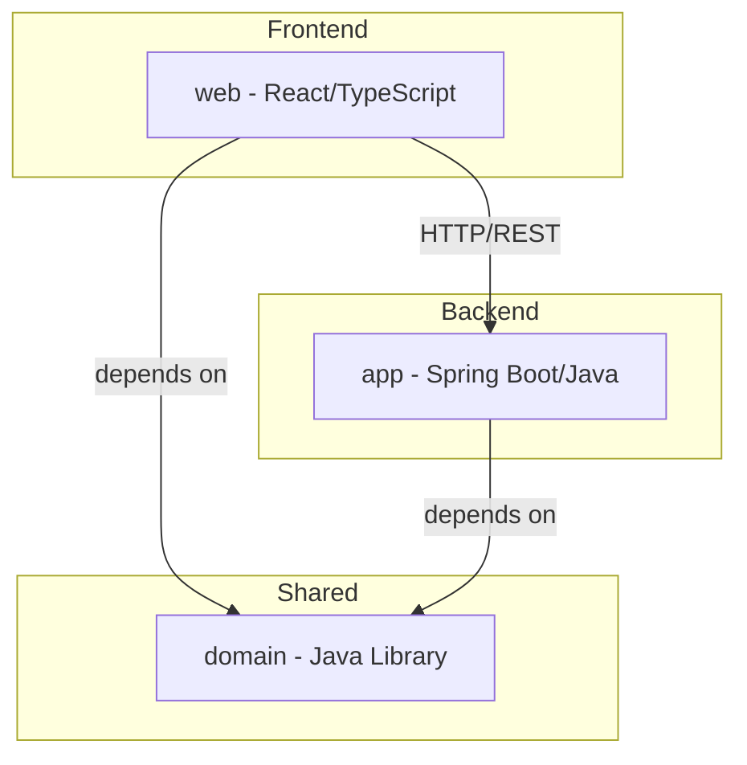

# Architecture

<!-- docguard:version 0.2.2 -->
<!-- docguard:status active -->
<!-- docguard:last-reviewed 2026-05-31 -->
<!-- docguard:owner @project-maintainer -->

> **Canonical document** — Design intent. This file defines WHAT the system does and how its parts fit together.
> The team MUST review changes to this file. Update `DRIFT-LOG.md` if code deviates.

| Metadata | Value |
|----------|-------|
| **Status** |  |
| **Version** | `0.2.2` |
| **Last Updated** | 2026-05-31 |
| **Owner** | @project-maintainer |

---

## System Overview

Techs is a multi-module monorepo containing a web frontend (React/TypeScript), a backend application (Java/Spring Boot), and a shared domain library (Java). The `web` and `app` modules depend on `domain`, which remains infrastructure-free and independently testable. This unidirectional dependency model keeps the shared layer clean.

## DocGuard Configuration

The project uses `.docguardignore` to exclude paths from DocGuard validation. This file follows gitignore-style syntax and excludes generated code (`**/__generated__/**`), migrations (`**/migrations/**`), and lock files (`package-lock.json`, `yarn.lock`, etc.) from documentation compliance checks.

## Component Map

| Component | Responsibility | Location | Tests |
|-----------|---------------|----------|-------|
| Web Frontend | User-facing presentation and interaction layer | `web/` | `web/src/**/*.test.{ts,tsx}` |
| App Backend | Server-side logic, API endpoints, data processing | `app/` | `app/src/test/java/` |
| Domain Library | Shared business logic, data models, validation rules, types | `domain/` | `domain/src/test/java/` |
| Root Config | Monorepo orchestration, shared tooling, CI/CD | `/` (root) | N/A |

## Layer Boundaries

| Layer | Can Import From | Cannot Import From |
|-------|----------------|-------------------|
| Web (frontend) | Domain (types, models, validation) | App (backend internals) |
| App (backend) | Domain (models, rules, validation) | Web (frontend internals) |
| Domain (shared) | Nothing (pure business logic) | Web, App (no infrastructure concerns) |

## Tech Stack

| Category | Technology | Version | License |
|----------|-----------|---------|---------|
| Language (frontend) | TypeScript | 5.x | Apache-2.0 |
| Framework (frontend) | React | 18.x | MIT |
| Build Tool (frontend) | Vite | 5.x | MIT |
| Language (backend) | Java | 21 (JDK 21) | GPL-2.0+CE |
| Framework (backend) | Spring Boot | 3.x | Apache-2.0 |
| Build Tool (backend) | Maven | 3.9+ | Apache-2.0 |
| Library (shared) | Lombok | Latest | MIT |
| Database | TBD | TBD | TBD |
| CI/CD | TBD | TBD | TBD |

## External Dependencies

| Service | Purpose | SLA | Fallback |
|---------|---------|-----|----------|
| None yet | N/A | N/A | N/A |

Document external services as features specify requirements for them.

## Infrastructure (IaC)

The project does not use Infrastructure-as-Code yet. Document the IaC layout here when introducing deployment infrastructure.

### Deployment Pipeline

Define the deployment pipeline when establishing CI/CD.

## Project Directory Structure

```text
techs/
├── web/                    # React + Vite + TypeScript frontend
│   ├── src/
│   │   ├── components/
│   │   ├── pages/
│   │   └── services/
│   ├── public/
│   ├── package.json
│   ├── tsconfig.json
│   └── vite.config.ts
├── app/                    # Java + Spring Boot backend
│   ├── src/
│   │   ├── main/java/
│   │   └── test/java/
│   └── pom.xml
├── domain/                 # Java shared library
│   ├── src/
│   │   ├── main/java/
│   │   └── test/java/
│   └── pom.xml
├── docs-canonical/         # CDD canonical documents (READ-ONLY design intent)
├── docs-implementation/    # CDD implementation docs (current state)
├── specs/                  # Feature specifications
├── AGENTS.md               # AI agent instructions
├── CHANGELOG.md            # Change tracking
└── DRIFT-LOG.md            # Canonical deviation tracking
```

## Diagrams



---

## Revision History

| Version | Date | Author | Changes |
|---------|------|--------|---------|
| 0.1.0 | 2026-05-31 | DocGuard Init | Initial template |
| 0.2.0 | 2026-05-31 | Constitution update | Filled all placeholders with project-specific architecture |
| 0.2.1 | 2026-05-31 | Doc quality fix | Documented .docguardignore |
| 0.2.2 | 2026-05-31 | Doc quality fix | Rewrote passive sentences to active voice |
